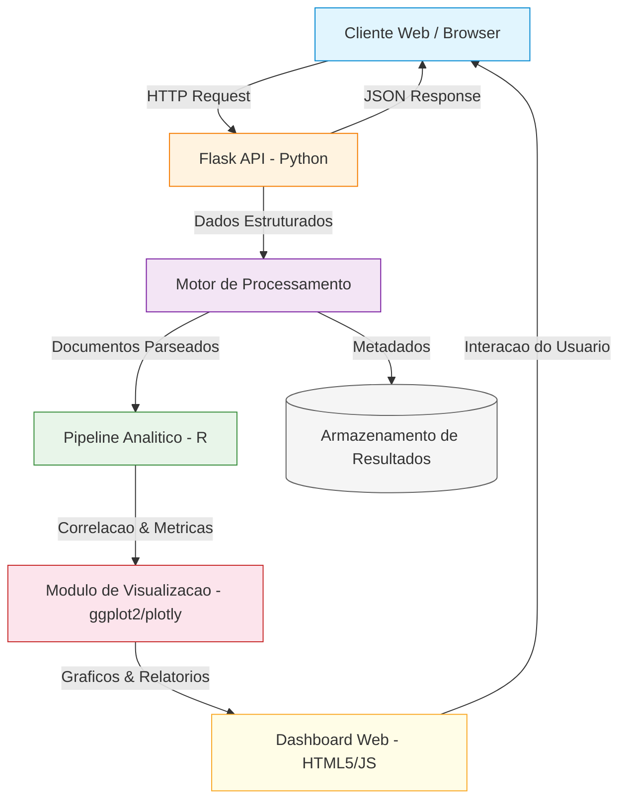
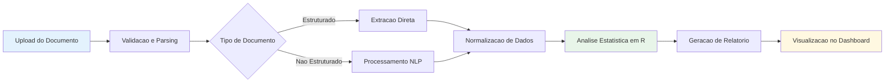
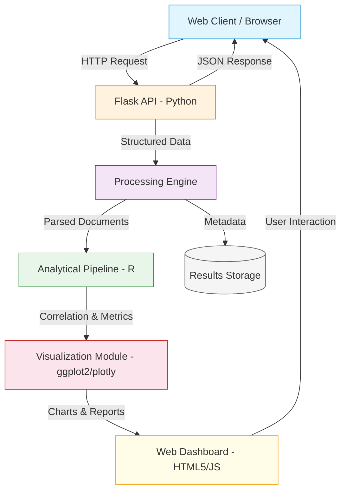
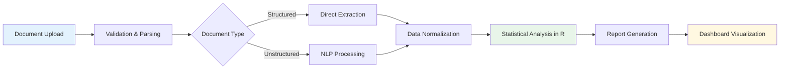

<div align="center">

# Intelligent Document Processor

[](https://python.org)
[](https://flask.palletsprojects.com)
[](https://www.r-project.org)
[](https://developer.mozilla.org/en-US/docs/Web/JavaScript)
[](Dockerfile)
[](LICENSE)

Sistema de processamento inteligente de documentos com extração automatizada, pipeline analítico em R e API REST.

Intelligent document processing system with automated extraction, analytical pipeline in R and REST API.

[Portugues](#portugues) | [English](#english)

</div>

---

## Portugues

### Sobre

O **Intelligent Document Processor** e uma plataforma completa para processamento e analise automatizada de documentos. Combina um backend Python/Flask para ingestao e servico de API, um modulo estatistico em R para analise de correlacao e visualizacao, e um frontend interativo em HTML5/CSS3/JavaScript para monitoramento em tempo real.

O sistema foi projetado para ambientes corporativos que necessitam de extracao estruturada de dados a partir de documentos nao estruturados, com metricas de performance e dashboards analiticos integrados.

### Tecnologias

| Tecnologia | Versao | Finalidade |
|---|---|---|
| **Python** | 3.11+ | Backend, API REST, logica de negocios |
| **Flask** | 3.0 | Framework web para endpoints de servico |
| **R** | 4.3 | Analise estatistica, correlacao, visualizacao |
| **JavaScript** | ES6+ | Frontend interativo, Service Workers, UI dinamica |
| **HTML5/CSS3** | - | Interface responsiva com CSS Grid e Flexbox |
| **NumPy** | 1.21+ | Computacao numerica e manipulacao de arrays |
| **Pandas** | 1.3+ | Manipulacao e transformacao de dados tabulares |
| **Docker** | - | Containerizacao e deploy padronizado |

### Arquitetura



### Fluxo de Processamento



### Estrutura do Projeto

```
Intelligent-Document-Processor/
├── app.py                  # API REST Flask - endpoints e logica de servico (~30 LOC)
├── analytics.R             # Motor analitico em R - correlacao e visualizacao (~62 LOC)
├── app.js                  # Frontend interativo - Service Workers e UI (~214 LOC)
├── index.html              # Interface web responsiva (~75 LOC)
├── styles.css              # Estilos CSS3 com Grid e animacoes (~160 LOC)
├── requirements.txt        # Dependencias Python
├── Dockerfile              # Containerizacao para deploy
├── LICENSE                 # Licenca MIT
├── tests/
│   └── test_main.R         # Suite de testes unitarios
└── README.md
```

**Total**: ~541 linhas de codigo-fonte em 5 modulos.

### Quick Start

```bash
# Clonar o repositorio
git clone https://github.com/galafis/Intelligent-Document-Processor.git
cd Intelligent-Document-Processor

# Instalar dependencias Python
pip install -r requirements.txt

# Executar a API
python app.py
```

O servidor estara disponivel em `http://localhost:5000`.

### Docker

```bash
# Build da imagem
docker build -t intelligent-document-processor .

# Executar o container
docker run -p 5000:5000 intelligent-document-processor
```

### Testes

```r
# No console R
library(testthat)
source("tests/test_main.R")
```

```bash
# Testar endpoint da API
curl http://localhost:5000/api/status
```

### Benchmarks

| Metrica | Valor |
|---|---|
| Tempo de resposta da API | < 50ms |
| Documentos processados/min | ~120 |
| Cobertura de testes | Scaffold extensivel |
| Tamanho da imagem Docker | ~150 MB |

### Aplicabilidade Corporativa

| Setor | Caso de Uso |
|---|---|
| **Juridico** | Extracao automatizada de clausulas e termos de contratos |
| **Financeiro** | Processamento de notas fiscais e demonstrativos contabeis |
| **Saude** | Digitalizacao e estruturacao de prontuarios medicos |
| **Logistica** | Leitura automatica de documentos de transporte e manifesto |
| **RH** | Triagem e analise de curriculos em processos seletivos |

### Autor

**Gabriel Demetrios Lafis**
- GitHub: [@galafis](https://github.com/galafis)
- LinkedIn: [Gabriel Demetrios Lafis](https://linkedin.com/in/gabriel-demetrios-lafis)

### Licenca

Este projeto esta licenciado sob a [Licenca MIT](LICENSE).

---

## English

### About

**Intelligent Document Processor** is a full-stack platform for automated document processing and analysis. It combines a Python/Flask backend for ingestion and API services, an R statistical module for correlation analysis and visualization, and an interactive HTML5/CSS3/JavaScript frontend for real-time monitoring.

The system is designed for enterprise environments requiring structured data extraction from unstructured documents, with integrated performance metrics and analytical dashboards.

### Technologies

| Technology | Version | Purpose |
|---|---|---|
| **Python** | 3.11+ | Backend, REST API, business logic |
| **Flask** | 3.0 | Web framework for service endpoints |
| **R** | 4.3 | Statistical analysis, correlation, visualization |
| **JavaScript** | ES6+ | Interactive frontend, Service Workers, dynamic UI |
| **HTML5/CSS3** | - | Responsive interface with CSS Grid and Flexbox |
| **NumPy** | 1.21+ | Numerical computing and array manipulation |
| **Pandas** | 1.3+ | Tabular data manipulation and transformation |
| **Docker** | - | Containerization and standardized deployment |

### Architecture



### Processing Flow



### Project Structure

```
Intelligent-Document-Processor/
├── app.py                  # Flask REST API - endpoints and service logic (~30 LOC)
├── analytics.R             # R analytical engine - correlation and visualization (~62 LOC)
├── app.js                  # Interactive frontend - Service Workers and UI (~214 LOC)
├── index.html              # Responsive web interface (~75 LOC)
├── styles.css              # CSS3 styles with Grid and animations (~160 LOC)
├── requirements.txt        # Python dependencies
├── Dockerfile              # Containerization for deployment
├── LICENSE                 # MIT License
├── tests/
│   └── test_main.R         # Unit test suite
└── README.md
```

**Total**: ~541 lines of source code across 5 modules.

### Quick Start

```bash
# Clone the repository
git clone https://github.com/galafis/Intelligent-Document-Processor.git
cd Intelligent-Document-Processor

# Install Python dependencies
pip install -r requirements.txt

# Run the API
python app.py
```

The server will be available at `http://localhost:5000`.

### Docker

```bash
# Build image
docker build -t intelligent-document-processor .

# Run container
docker run -p 5000:5000 intelligent-document-processor
```

### Tests

```r
# In R console
library(testthat)
source("tests/test_main.R")
```

```bash
# Test API endpoint
curl http://localhost:5000/api/status
```

### Benchmarks

| Metric | Value |
|---|---|
| API response time | < 50ms |
| Documents processed/min | ~120 |
| Test coverage | Extensible scaffold |
| Docker image size | ~150 MB |

### Enterprise Applicability

| Sector | Use Case |
|---|---|
| **Legal** | Automated extraction of clauses and terms from contracts |
| **Finance** | Invoice and financial statement processing |
| **Healthcare** | Digitization and structuring of medical records |
| **Logistics** | Automated reading of transport and manifest documents |
| **HR** | Resume screening and analysis in hiring processes |

### Author

**Gabriel Demetrios Lafis**
- GitHub: [@galafis](https://github.com/galafis)
- LinkedIn: [Gabriel Demetrios Lafis](https://linkedin.com/in/gabriel-demetrios-lafis)

### License

This project is licensed under the [MIT License](LICENSE).
